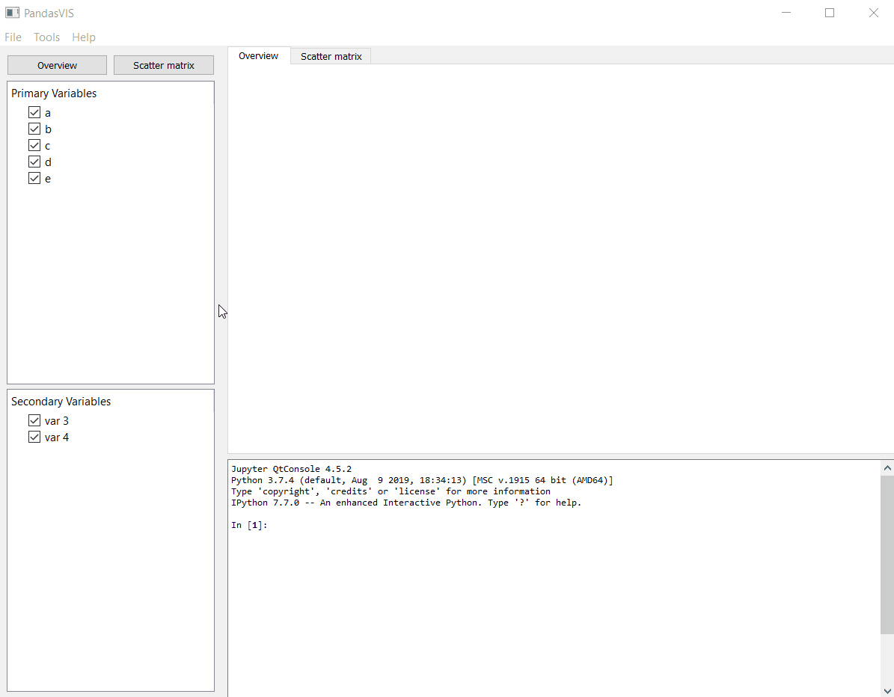

# PandasVIS
Data exploration GUI: a quick and easy way to generate awesome interactive plots for your data, (soon) with Data Science and Machine Learning tools. <br>

Powered by: [PySide2](https://wiki.qt.io/Qt_for_Python), [Pandas](https://pandas.pydata.org/) <br>
Awesome visualizations rendering: [Voila](https://github.com/voila-dashboards/voila), [QtVoila](https://github.com/luiztauffer/qtvoila) <br>
Awesome visualizations producing: [Pandas Profiling](https://github.com/pandas-profiling/pandas-profiling), [Plotly](https://plot.ly/) <br>
Embedded IPython console: [QtConsole](https://ipython.org/ipython-doc/dev/interactive/qtconsole.html)

### Installation
To install PandasVIS directly in an existing environment:

```bash
pip install git+https://github.com/luiztauffer/pandasVIS
```

### Usage

PandasVIS module can be imported and the GUI initialized with:
```python
from pandasvis.main import main as pdvis

app = pdvis()
```

Save this convenience script, e.g. `run_pandas_vis.py`, in any directory and run in terminal:
```bash
$ python run_pandas_vis.py
```

### Examples

